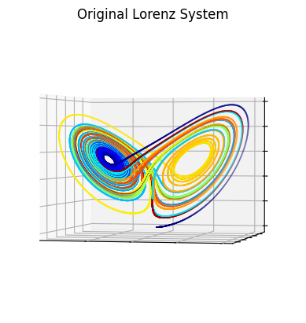
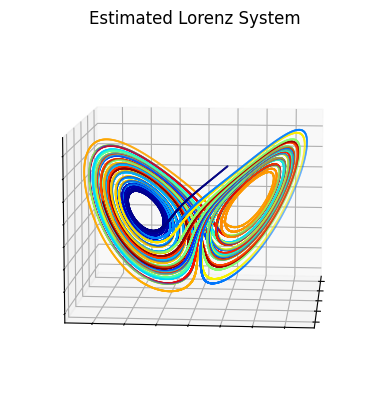

# SINDyDL

This repo is an unofficial PyTorch 2.x implementation of the paper 
[Data-Driven Discovery of Coordinates and Governing Equations
](https://github.com/kpchamp/SindyAutoencoders/tree/master).

This repo reproduces the results of the paper on the Lorenz system (first-order dynamical system) 
and those of the pendulum (second-order).

Example results for the Lorenz system are shown below:

For the pendulum, I found that I had better convergence when I initialized the weights with 1's. This is notable 
because the paper mentions that they had 
issues with convergence for the pendulum example. This does have an interesting consequence though eliminates the impact of SINDy 
loss for x on the model.
To understand why, first know that the activation function I use is the sigmoid, $\sigma(\cdot)$ function. In the computation, we need to compute
its derivative which is $$ \sigma(x) * (1 - \sigma(x)) $$. Because the weights and initial SINDy coefficients area all ones, $\sigma(x)$
is equal to 1. As a result, $(1 - \sigma(x)) = 0$. This 0 propogates through the loss computation and eliminates its utility during training.
That being said, this fact did not seem to hamper the model's ability to learn the dynamics.

The pendulum data was a series of images of size (51, 51) with the pendulum itself taking the form of a gaussian blob (see below).
